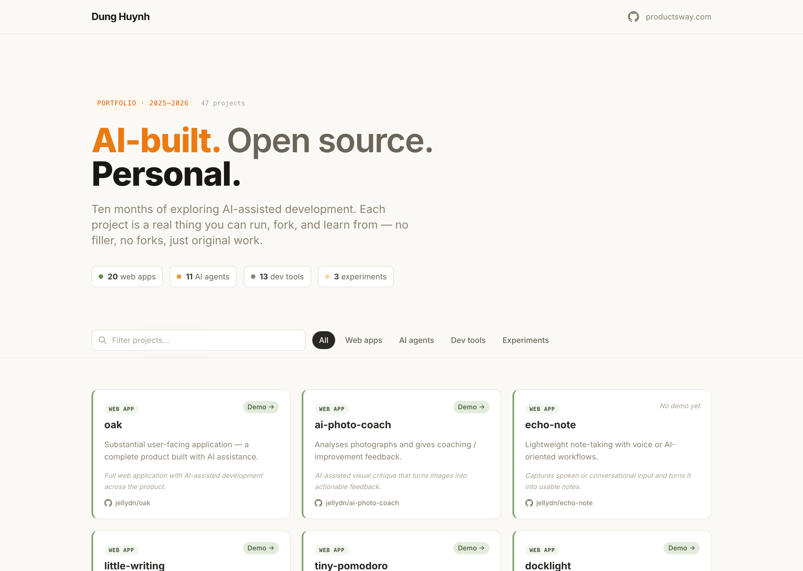

# Welcome to personal-ai 👋

[](https://github.com/jellydn/personal-ai/stargazers)
[](https://github.com/jellydn/personal-ai/pulls)
[](https://twitter.com/jellydn)

> **A living tracker of open-source projects built with AI** — public original work from active AI exploration.

This repo catalogues **public original** repositories created while exploring AI-assisted development between **October 20, 2025 and July 31, 2026**. Forks and private repositories are excluded.

Over nine months: 53 public projects spanning web apps, AI agents, RAG systems, developer tools, editor extensions, local-model utilities, and productivity apps.



> See [docs/demo-script.md](docs/demo-script.md) for a 30–60 second recording
> script, and [docs/images/README.md](docs/images/README.md) for how the
> screenshot was captured.

## 🖥️ Showcase site

A dedicated marketing site ([live demo](https://jellydn.github.io/personal-ai/showcase/)) walks through the tracker with real screenshots — search, category filters, live demos, and a step-by-step how-it-works guide. Source lives in [`showcase/`](./showcase/).

## 📑 Contents

- [Showcase site](#-showcase-site)
- [Tech stack](#-tech-stack)
- [Getting started](#-getting-started)
- [Environment variables](#-environment-variables)
- [Example workflow](#-example-workflow)
- [Reliability and safety](#-reliability-and-safety)
- [Evaluation](#-evaluation)
- [Project structure](#-project-structure)
- [Limitations](#-limitations)
- [Future improvements](#-future-improvements)
- [Web & user-facing apps](#-web--user-facing-apps)
- [AI agents & AI apps](#-ai-agents--ai-apps)
- [Developer & editor tools](#-developer--editor-tools)
- [Learning & experiments](#-learning--experiments)
- [Notes](#-notes)
- [Author](#-author)
- [License](#-license)
- [Show your support](#-show-your-support)

## 🧰 Tech stack

| Layer | Technology |
| --- | --- |
| Markup | Semantic HTML5 |
| Styling | Tailwind CSS (CDN) + a small inline CSS block |
| Logic | Vanilla JavaScript (no framework, no dependencies) |
| Fonts | Inter + JetBrains Mono (Google Fonts) |
| Hosting | GitHub Pages |
| CI/CD | GitHub Actions (`deploy.yml`) |
| Local dev | `serve` (a lightweight static file server, optional) |

## 🚀 Getting started

### Prerequisites

- A modern browser. That is all — the site is static.
- Optional: [Node.js](https://nodejs.org/) 18+ and npm, only if you want the
  local dev server.

### Steps

1. **Clone the repository**

   ```bash
   git clone https://github.com/jellydn/personal-ai.git
   cd personal-ai
   ```

2. **(Optional) Install the local dev server**

   ```bash
   npm install
   ```

3. **Run the app locally**

   ```bash
   npm run dev
   ```

   Then open the printed URL (default `http://localhost:3000`).

   > No Node? Just open `index.html` directly in your browser — the site works
   > from the filesystem too.

4. **Open the live site**

   Visit https://jellydn.github.io/personal-ai/

There is no build step. The files in the repository root are served exactly as
they are.

## 🔑 Environment variables

This project requires **no environment variables**. It is a fully static site
with no backend, database, or API keys.

| Variable | Required | Description | Default |
| --- | --- | --- | --- |
| _(none)_ | — | No configuration is needed. | — |

See [`.env.example`](.env.example) for details. The `.env` file that appears in
the Amp sandbox is generated automatically by the sandbox manager, is ignored by
`.gitignore`, and is **not** part of this project.

## 🧪 Example workflow

1. **User visits** the homepage. The hero, summary stats, and filter bar render
   immediately; the full 53-card grid appears with a staggered entrance
   animation.
2. **User searches** by typing `rag` in the filter box. The grid narrows to the
   matching projects (`rag-blog`, `rag-learning-guide`) in real time — no network
   request, no reload.
3. **User clicks** the "AI agents" filter pill. The grid updates to the 15
   agent-related projects.
4. **User clicks** a "Demo →" badge on a card to open that project's live demo
   in a new tab, or the repo link to view its source on GitHub.
5. **User clears** the search and returns to "All" to browse the full catalog.

## 🛡️ Reliability and safety

- **No secrets in the repo** — the site ships no credentials; `.env` is gitignored and only ever holds sandbox-generated metadata, never app secrets.
- **Input handling** — the search box performs case-insensitive substring matching on a fixed in-memory dataset; user input is never evaluated or injected as HTML, so there is no XSS surface from filtering.
- **External links** — all project and demo links use `target="_blank"` with `rel="noopener"` to prevent tab-nabbing.
- **Accessibility safety net** — focus-visible outlines, ARIA labels on icon links, and `prefers-reduced-motion` handling ensure the site degrades gracefully.
- **Deploy safety** — the GitHub Actions workflow uses the official `actions/deploy-pages` action with minimal permissions (`contents: read`, `pages: write`, `id-token: write`).

> No retries, timeouts, rate limits, or fallbacks are implemented because the
> site makes no network requests of its own (other than the Tailwind CDN and
> Google Fonts).

## ✅ Evaluation

There is no automated test suite or benchmark for this project — it is a static
catalog, not an AI runtime. Quality is assessed manually:

- **Visual review** — load the site at 1440×900 and 375×812; confirm the grid,
  filters, search, and empty state behave correctly.
- **Link integrity** — verify that demo and repo links resolve.
- **Data accuracy** — confirm the 53 listed projects match the author's actual
  public repositories in the October 2025 – July 2026 window.
- **Accessibility check** — run Lighthouse and confirm the page scores well on
  accessibility and best-practices.

A CI guard ([`scripts/check-category-config.js`](scripts/check-category-config.js))
verifies every project category in `index.html` has a style definition, so future
catalog additions can't silently mis-style. A future improvement is a fuller smoke
test asserting the project count and link structure (see [Limitations](#limitations)
and [Future improvements](#future-improvements)).

## 📁 Project structure

```text
personal-ai/
├── index.html                 # Root portfolio: markup, styles, data, and logic
├── showcase/                  # Dedicated marketing site (index, features, how-it-works, FAQ)
├── scripts/
│   └── check-category-config.js   # CI guard: category ↔ style completeness
├── docs/
│   ├── demo-script.md         # 30–60 second demo recording script
│   └── images/
│       └── README.md          # Screenshot capture guide
├── package.json               # Optional local dev server script (no app deps)
├── .env.example               # Documents that no env vars are required
├── .gitignore
└── .github/
    └── workflows/
        └── deploy.yml         # GitHub Pages deployment workflow
```

## ⚠️ Limitations

- **Static data** — the project list is hardcoded in `index.html`. Adding or
  updating a project means editing the HTML and redeploying; there is no CMS or
  data file to edit separately.
- **Minimal automated checks** — the CI guard covers category styling only;
  regressions elsewhere are caught only by manual review.
- **CDN dependency** — Tailwind CSS and Google Fonts are loaded from CDNs, so the
  site requires an internet connection to render with full styling.
- **No live repo metadata** — stars, last-updated dates, and descriptions are not
  fetched from the GitHub API; they reflect a manual snapshot.
- **Single author** — the catalog is specific to one developer's work and is not
  a general-purpose portfolio platform.
- **No license** — this repository currently has no license file. All rights are
  reserved by the author until one is added.

## 🚧 Future improvements

1. **Extract project data to JSON** — move the `projects` array into a separate
   `projects.json` file fetched at runtime, so content edits do not touch markup.
2. **Fetch live GitHub metadata** — pull stars, language, and last-updated dates
   from the GitHub API to keep the catalog current automatically.
3. **Expand the smoke test** — extend the CI guard to assert the 53-card count,
   link structure, and filter behaviour.
4. **Self-host Tailwind** — replace the CDN with a built CSS file so the site
   works offline and avoids a render-blocking external request.
5. **Per-project detail pages** — deep links with a short summary, tech stack,
   and screenshots for each project, generated from the data file.

## 🌐 Web & user-facing apps

### [oak](https://github.com/jellydn/oak)

- **Description**: Substantial user-facing application — a clear example of a complete product built with AI assistance.
- **Approach**: Full web application with AI-assisted development across the product.
- **Demo**: Not ready yet.

### [ai-photo-coach](https://github.com/jellydn/ai-photo-coach)

- **Description**: Analyses photographs and gives coaching / improvement feedback.
- **Approach**: AI-assisted visual critique that turns images into actionable feedback.
- **Demo**: Not ready yet.

### [echo-note](https://github.com/jellydn/echo-note)

- **Description**: Lightweight note-taking with voice or AI-oriented workflows.
- **Approach**: Captures spoken or conversational input and turns it into usable notes.
- **Demo**: Not ready yet.

### [little-writing](https://github.com/jellydn/little-writing)

- **Description**: Writing application designed for younger learners.
- **Approach**: Simple educational writing experience built with AI-assisted development.
- **Demo**: Not ready yet.

### [tiny-pomodoro](https://github.com/jellydn/tiny-pomodoro)

- **Description**: Minimal Pomodoro timer.
- **Approach**: Small productivity app with a focused single-purpose workflow.
- **Demo**: Not ready yet.

### [docklight](https://github.com/jellydn/docklight)

- **Description**: Developer web UI for managing or inspecting Docker-related resources.
- **Approach**: Browser-based workflow for Docker inspection and management.
- **Demo**: Not ready yet.

### [ai-smart-gmail](https://github.com/jellydn/ai-smart-gmail)

- **Description**: AI-assisted Gmail organisation and email processing.
- **Approach**: Applies AI to triage and interpret email content.
- **Demo**: https://jellydn.github.io/ai-smart-gmail/lessons/0001-what-is-an-embedding.html

### [smart-resume-matcher](https://github.com/jellydn/smart-resume-matcher)

- **Description**: Compares resumes with job descriptions using semantic / AI analysis.
- **Approach**: Semantic matching between candidate profiles and job requirements.
- **Demo**: https://smart-resume.itman.fyi

### [rag-blog](https://github.com/jellydn/rag-blog)

- **Description**: Retrieval-augmented generation grounded in blog content.
- **Approach**: Retrieves relevant passages before generating answers.
- **Demo**: https://jellydn.github.io/rag-blog/

### [logpilot](https://github.com/jellydn/logpilot)

- **Description**: Developer app for investigating and understanding application logs.
- **Approach**: Uses AI to summarise and reason about logs during debugging.
- **Demo**: Not ready yet.

### [sky-alert](https://github.com/jellydn/sky-alert)

- **Description**: Alerting / monitoring application.
- **Approach**: Lightweight utility focused on notifications and monitoring workflows.
- **Demo**: Not ready yet.

### [activity-tracker](https://github.com/jellydn/activity-tracker)

- **Description**: Lightweight personal activity tracking.
- **Approach**: Captures and organises activity data with a simple user-facing interface.
- **Demo**: Not ready yet.

### [streaming-chat-demo](https://github.com/jellydn/streaming-chat-demo)

- **Description**: Side-by-side comparison of streaming vs non-streaming AI chat responses.
- **Approach**: Measures how streaming improves perceived latency and UX.
- **Demo**: Not ready yet.

### [sellsnap](https://github.com/jellydn/sellsnap)

- **Description**: Sell in a snap — the fastest way for creators to sell digital products online.
- **Approach**: Focused storefront workflow for digital goods.
- **Demo**: Not ready yet.

### [prosody](https://github.com/jellydn/prosody)

- **Description**: English Rhythm Coach.
- **Approach**: Guides learners through English prosody and rhythm practice.
- **Demo**: Not ready yet.

### [tweet-print](https://github.com/jellydn/tweet-print)

- **Description**: Paste a Twitter/X link → preview → download as a clean PDF.
- **Approach**: Turns tweet threads into readable, printable documents.
- **Demo**: Not ready yet.

### [VoiceInk](https://github.com/jellydn/VoiceInk)

- **Description**: Voice-to-text app for macOS that transcribes what you say almost instantly.
- **Approach**: Native low-latency transcription on demand.
- **Demo**: Not ready yet.

## 🤖 AI agents & AI apps

### [tiny-coding-agent](https://github.com/jellydn/tiny-coding-agent)

- **Description**: Minimal coding agent for learning and demonstrating agent loops.
- **Approach**: Small agent loop focused on tool execution and iteration.
- **Demo**: Not ready yet.

### [hermes-hub](https://github.com/jellydn/hermes-hub)

- **Description**: Self-hosted Hermes Agent hub with personas, jobs, and delegated workflows.
- **Approach**: Orchestrates agent workflows and scheduled execution.
- **Demo**: https://hermes-hub.itman.fyi/

### [openralph](https://github.com/jellydn/openralph)

- **Description**: Autonomous Ralph-style coding loop with OpenCode support.
- **Approach**: Runs an autonomous coding cycle around an AI agent and coding toolchain.
- **Demo**: https://ai-tools.itman.fyi

### [my-ai-tools](https://github.com/jellydn/my-ai-tools)

- **Description**: Portable workspace for AI coding agents, skills, memory, and MCP configs.
- **Approach**: Bundles reusable agent runtime pieces into one workspace.
- **Demo**: http://ai-tools.itman.fyi/

### [ai-flow](https://github.com/jellydn/ai-flow)

- **Description**: AI-assisted development and workflow orchestration.
- **Approach**: Organises repeatable AI-assisted workflows around development tasks.
- **Demo**: https://ai-flow.itman.fyi/

### [ai-launcher](https://github.com/jellydn/ai-launcher)

- **Description**: Launcher for accessing and managing AI coding tools.
- **Approach**: Centralises access to multiple coding assistants and tools.
- **Demo**: http://ai-cli.itman.fyi/

### [tiny-local-ai](https://github.com/jellydn/tiny-local-ai)

- **Description**: Minimal environment for experimenting with locally hosted models.
- **Approach**: Lightweight local setup for model testing and iteration.
- **Demo**: Not ready yet.

### [9router](https://github.com/jellydn/9router)

- **Description**: Unlimited FREE AI coding — connect Claude Code, Codex, Cursor, Cline, Copilot, and Antigravity to free Claude/GPT/Gemini models.
- **Approach**: Routes multiple coding assistants through free model backends.
- **Demo**: Not ready yet.

### [TelePi](https://github.com/jellydn/TelePi)

- **Description**: Telegram bridge for the Pi coding agent — continue sessions from your phone.
- **Approach**: Brings voice, images, and handback control to Pi over Telegram.
- **Demo**: Not ready yet.

### [clawdbot](https://github.com/jellydn/clawdbot)

- **Description**: Your own personal AI assistant. Any OS. Any platform.
- **Approach**: Self-hosted personal assistant built around an agent runtime.
- **Demo**: Not ready yet.

### [ccs](https://github.com/jellydn/ccs)

- **Description**: Switch between Claude accounts, Gemini, Copilot, and OpenRouter (300+ models) via a CLIProxyAPI OAuth proxy.
- **Approach**: Visual profile switcher for multiple AI CLI backends.
- **Demo**: Not ready yet.

### [mdflow](https://github.com/jellydn/mdflow)

- **Description**: Multi-backend CLI for executable markdown prompts.
- **Approach**: Runs .md prompt files against Claude, Codex, Gemini, or Copilot.
- **Demo**: Not ready yet.

### [claude-mem](https://github.com/jellydn/claude-mem)

- **Description**: A Claude Code plugin that automatically captures everything Claude does during coding sessions.
- **Approach**: Compresses and stores session memory for continuity across runs.
- **Demo**: Not ready yet.

### [flue-repo-assistant](https://github.com/jellydn/flue-repo-assistant)

- **Description**: Repository analysis agent powered by Flue.
- **Approach**: Analyses a repo and produces structured findings via an agent loop.
- **Demo**: Not ready yet.

### [prompt-bench](https://github.com/jellydn/prompt-bench)

- **Description**: A tool for benchmarking LLM prompts.
- **Approach**: Compares prompt variants across models on structured metrics.
- **Demo**: Not ready yet.

## 🛠️ Developer & editor tools

### [zed-codemux](https://github.com/jellydn/zed-codemux)

- **Description**: Zed-based interface for parallel coding-agent sessions.
- **Approach**: Helps manage several coding sessions in parallel.
- **Demo**: Not ready yet.

### [vscode-mux](https://github.com/jellydn/vscode-mux)

- **Description**: VS Code tool for multiplexing terminals or coding sessions.
- **Approach**: Organises concurrent terminals and coding workflows inside the editor.
- **Demo**: Not ready yet.

### [vscode-seal-code](https://github.com/jellydn/vscode-seal-code)

- **Description**: VS Code integration for the SealCode workflow.
- **Approach**: Extends the editor with workflow-specific AI coding support.
- **Demo**: https://jellydn.github.io/vscode-seal-code/

### [pi-clinepass-provider](https://github.com/jellydn/pi-clinepass-provider)

- **Description**: Pi model provider for ClinePass-compatible access.
- **Approach**: Bridges provider access into coding-agent tooling.
- **Demo**: https://jellydn.github.io/pi-clinepass-provider/

### [pi-qwencloud-provider](https://github.com/jellydn/pi-qwencloud-provider)

- **Description**: Pi provider for Qwen Cloud models and token plans.
- **Approach**: Adapts cloud model access for agent and coding workflows.
- **Demo**: https://jellydn.github.io/pi-qwencloud-provider/

### [devlog](https://github.com/jellydn/devlog)

- **Description**: Zero-code log capture for local development.
- **Approach**: Captures server logs via tmux and browser console logs via a native messaging host from a single YAML config.
- **Demo**: https://jellydn.github.io/devlog/

### [dotenv-tui](https://github.com/jellydn/dotenv-tui)

- **Description**: Terminal interface for managing environment variables.
- **Approach**: TUI for editing and organising env data.
- **Demo**: Not ready yet.

### [keybinder](https://github.com/jellydn/keybinder)

- **Description**: Keyboard shortcut and binding utility.
- **Approach**: Simplifies creation and management of keyboard bindings.
- **Demo**: Not ready yet.

### [tiny-cloak.nvim](https://github.com/jellydn/tiny-cloak.nvim)

- **Description**: Small Neovim utility for hiding or protecting sensitive values.
- **Approach**: Minimises accidental exposure of secrets in the editor.
- **Demo**: Not ready yet.

### [tiny-term.nvim](https://github.com/jellydn/tiny-term.nvim)

- **Description**: Minimal terminal-management plugin for Neovim.
- **Approach**: Adds lightweight terminal handling inside Neovim.
- **Demo**: Not ready yet.

### [minui-easy-installer](https://github.com/jellydn/minui-easy-installer)

- **Description**: Simplified installer for MinUI.
- **Approach**: Streamlines setup and installation into a simpler flow.
- **Demo**: Not ready yet.

### [opencode-clinepass-provider](https://github.com/jellydn/opencode-clinepass-provider)

- **Description**: ClinePass provider plugin for Opencode.
- **Approach**: Authenticates opencode via Cline Pass (CLI subscription or static API key).
- **Demo**: Not ready yet.

### [opencode-qwencloud-provider](https://github.com/jellydn/opencode-qwencloud-provider)

- **Description**: QwenCloud provider config for opencode.
- **Approach**: Adds Qwen3.8/3.7/3.6, DeepSeek V4, and GLM-5.2 via QwenCloud's OpenAI-compatible API.
- **Demo**: Not ready yet.

### [pi-agy-provider](https://github.com/jellydn/pi-agy-provider)

- **Description**: Pi provider for Google Antigravity.
- **Approach**: Bridges Google Antigravity into pi agent tooling.
- **Demo**: Not ready yet.

### [pi-fireworks-provider](https://github.com/jellydn/pi-fireworks-provider)

- **Description**: Pi provider for Fireworks.
- **Approach**: Adds Fireworks-hosted models to pi agent tooling.
- **Demo**: Not ready yet.

### [vscode-whichkey](https://github.com/jellydn/vscode-whichkey)

- **Description**: which-key style menu for Visual Studio Code.
- **Approach**: Shows available key sequences inline while typing chords.
- **Demo**: Not ready yet.

### [herdr-file-viewer](https://github.com/jellydn/herdr-file-viewer)

- **Description**: A git-aware, read-only file viewer for herdr.
- **Approach**: Mouse-friendly, keyboard-driven TUI with tree + content panes.
- **Demo**: Not ready yet.

## 📚 Learning & experiments

### [ai-architect-4-weeks](https://github.com/jellydn/ai-architect-4-weeks)

- **Description**: Four-week practical AI architecture programme.
- **Approach**: Breaks AI architecture learning into hands-on weekly milestones.
- **Demo**: Not ready yet.

### [rag-learning-guide](https://github.com/jellydn/rag-learning-guide)

- **Description**: Exercises and notes for learning production RAG.
- **Approach**: Teaches RAG through examples and guided practice.
- **Demo**: Not ready yet.

### [99](https://github.com/jellydn/99)

- **Description**: Experimental / challenge-based development project.
- **Approach**: Exploration-oriented repository for iterative experimentation.
- **Demo**: Not ready yet.

### [daily-exercism-quad](https://github.com/jellydn/daily-exercism-quad)

- **Description**: Daily programming practice project.
- **Approach**: Consistent practice through repeated exercises and small implementations.
- **Demo**: Not ready yet.

## 📝 Notes

- Each project is listed once under its primary category.
- Projects in the window above were curated with the help of a GitHub date-filtered public repository search.
- The list stays focused on **public original** work built while exploring AI.
- **Do not add forked repositories** — only public original work is listed here.
- New projects land here as exploration continues — this is a tracker, not a frozen portfolio.

## 👤 Author

**Dung Huynh**

- Website: [productsway.com](https://productsway.com)
- YouTube: [IT Man Channel](https://www.youtube.com/@it-man)
- GitHub: [@jellydn](https://github.com/jellydn)

---

## 📄 License

This repository currently has **no license**. All rights are reserved by the
author. If you would like to use or adapt the code, please open an issue to
discuss licensing.

---

## ⭐ Show your support

Give a ⭐️ if this tracker helped you discover something useful!

[](https://github.com/jellydn/personal-ai/stargazers)
[](https://ko-fi.com/dunghd)
[](https://github.com/sponsors/jellydn)

---

Made with ❤️ by [Dung Huynh](https://productsway.com)
