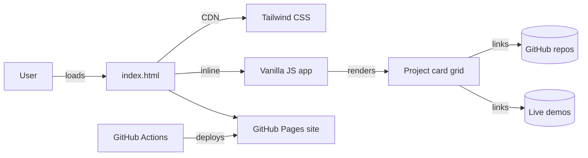

# personal-ai

> A static portfolio catalog that lets a visitor grasp nine months of original, AI-assisted open-source work in under a minute — what was built, how, and where to try it.

## Overview

**personal-ai** is a single-page showcase of **34 public, original repositories** created by [Dung Huynh](https://productsway.com) while exploring AI-assisted development between October 2025 and July 2026. Forks and private repos are excluded; every entry is something you can run, fork, and learn from.

The site exists because a GitHub profile is a flat list of repositories — it does not communicate *what each project does*, *how it was approached*, or *whether it has a live demo*. This catalog solves that with a searchable, filterable card grid that links each project to its source and demo.

It is built for **recruiters, hiring managers, and fellow developers** who want to evaluate breadth and depth quickly, and for the author to track his own AI-engineering output over time.

### AI / agentic engineering concepts demonstrated

This repository itself is a **lightweight front-end artifact** rather than an AI runtime, but it documents 34 projects that span the core agentic-engineering surface area:

- **Agent loops & tool execution** — `tiny-coding-agent`, `openralph`
- **Retrieval-augmented generation (RAG)** — `rag-blog`, `rag-learning-guide`
- **Agent orchestration & scheduled workflows** — `hermes-hub`, `ai-flow`
- **Provider integration for coding agents** — `pi-clinepass-provider`, `pi-qwencloud-provider`
- **Semantic matching** — `smart-resume-matcher`
- **Local model experimentation** — `tiny-local-ai`
- **Editor-integrated AI workflows** — `vscode-seal-code`, `zed-codemux`, `vscode-mux`

## Demo


- **Live site**: https://jellydn.github.io/personal-ai/
- **Source**: https://github.com/jellydn/personal-ai

> A short demo video/GIF can be added at `docs/images/demo.gif`. See
> [docs/demo-script.md](docs/demo-script.md) for a 30–60 second recording script,
> and [docs/images/README.md](docs/images/README.md) for screenshot capture
> instructions.

## Key features

- **34 curated projects** across four categories: web apps (12), AI agents (7), developer tools (11), and experiments (4).
- **Live text search** — filter projects by name, description, approach, or repo in real time, client-side.
- **Category filtering** — one-click pills to scope the grid to a single category.
- **Demo links** — cards with a live demo show a clickable badge; others indicate "No demo yet".
- **Empty state** — a friendly message appears when a search matches nothing.
- **Responsive grid** — 1 / 2 / 3 columns from mobile to desktop.
- **Staggered entrance animations** with a hover-lift card effect.
- **Accessibility** — keyboard-focusable controls, ARIA labels, visible focus rings, and `prefers-reduced-motion` support.
- **Zero build step** — a single `index.html` served as-is; deploys to GitHub Pages with no compilation.

## Architecture



The entire application is one self-contained HTML file:

1. **Data** — a `projects` array of 34 entries is defined inline in a `<script>` tag (name, repo, description, approach, demo URL, category).
2. **Rendering** — a `filter()` function reads the search query and active category, filters the array, and re-renders the card grid via template literals.
3. **Interaction** — `input` and `click` listeners on the search box and filter pills re-run `filter()` with no page reload.
4. **Styling** — Tailwind CSS is loaded from the CDN with a custom theme (ink/ember/moss palette) plus a small inline `<style>` block for animations and scrollbar styling.
5. **Deployment** — a GitHub Actions workflow uploads the repo root as a Pages artifact on every push to `main`.

## Tech stack

| Layer | Technology |
| --- | --- |
| Markup | Semantic HTML5 |
| Styling | Tailwind CSS (CDN) + a small inline CSS block |
| Logic | Vanilla JavaScript (no framework, no dependencies) |
| Fonts | Inter + JetBrains Mono (Google Fonts) |
| Hosting | GitHub Pages |
| CI/CD | GitHub Actions (`deploy.yml`) |
| Local dev | `serve` (a lightweight static file server, optional) |

## Getting started

### Prerequisites

- A modern browser. That is all — the site is static.
- Optional: [Node.js](https://nodejs.org/) 18+ and npm, only if you want the
  local dev server.

### Steps

1. **Clone the repository**

   ```bash
   git clone https://github.com/jellydn/personal-ai.git
   cd personal-ai
   ```

2. **(Optional) Install the local dev server**

   ```bash
   npm install
   ```

3. **Run the app locally**

   ```bash
   npm run dev
   ```

   Then open the printed URL (default `http://localhost:3000`).

   > No Node? Just open `index.html` directly in your browser — the site works
   > from the filesystem too.

4. **Open the live site**

   Visit https://jellydn.github.io/personal-ai/

There is no build step. The files in the repository root are served exactly as
they are.

## Environment variables

This project requires **no environment variables**. It is a fully static site
with no backend, database, or API keys.

| Variable | Required | Description | Default |
| --- | --- | --- | --- |
| _(none)_ | — | No configuration is needed. | — |

See [`.env.example`](.env.example) for details. The `.env` file that appears in
the Amp sandbox is generated automatically by the sandbox manager, is ignored by
`.gitignore`, and is **not** part of this project.

## Example workflow

1. **User visits** the homepage. The hero, summary stats, and filter bar render
   immediately; the full 34-card grid appears with a staggered entrance
   animation.
2. **User searches** by typing `rag` in the filter box. The grid narrows to the
   matching projects (`rag-blog`, `rag-learning-guide`) in real time — no network
   request, no reload.
3. **User clicks** the "AI agents" filter pill. The grid updates to the 7
   agent-related projects.
4. **User clicks** a "Demo →" badge on a card to open that project's live demo
   in a new tab, or the repo link to view its source on GitHub.
5. **User clears** the search and returns to "All" to browse the full catalog.

## Reliability and safety

- **No secrets in the repo** — the site ships no credentials; `.env` is gitignored and only ever holds sandbox-generated metadata, never app secrets.
- **Input handling** — the search box performs case-insensitive substring matching on a fixed in-memory dataset; user input is never evaluated or injected as HTML, so there is no XSS surface from filtering.
- **External links** — all project and demo links use `target="_blank"` with `rel="noopener"` to prevent tab-nabbing.
- **Accessibility safety net** — focus-visible outlines, ARIA labels on icon links, and `prefers-reduced-motion` handling ensure the site degrades gracefully.
- **Deploy safety** — the GitHub Actions workflow uses the official `actions/deploy-pages` action with minimal permissions (`contents: read`, `pages: write`, `id-token: write`).

> No retries, timeouts, rate limits, or fallbacks are implemented because the
> site makes no network requests of its own (other than the Tailwind CDN and
> Google Fonts).

## Evaluation

There is no automated test suite or benchmark for this project — it is a static
catalog, not an AI runtime. Quality is assessed manually:

- **Visual review** — load the site at 1440×900 and 375×812; confirm the grid,
  filters, search, and empty state behave correctly.
- **Link integrity** — verify that demo and repo links resolve.
- **Data accuracy** — confirm the 34 listed projects match the author's actual
  public repositories in the October 2025 – July 2026 window.
- **Accessibility check** — run Lighthouse and confirm the page scores well on
  accessibility and best-practices.

A future improvement is to add a smoke test that asserts the project count and
link structure (see [Limitations](#limitations) and
[Future improvements](#future-improvements)).

## Project structure

```
personal-ai/
├── index.html                 # The entire app: markup, styles, data, and logic
├── .github/
│   └── workflows/
│       └── deploy.yml         # GitHub Pages deployment workflow
├── docs/
│   ├── demo-script.md         # 30–60 second demo recording script
│   └── images/
│       └── README.md          # Screenshot capture guide
├── package.json               # Optional local dev server script (no app deps)
├── .env.example               # Documents that no env vars are required
└── .gitignore
```

## Limitations

- **Static data** — the project list is hardcoded in `index.html`. Adding or
  updating a project means editing the HTML and redeploying; there is no CMS or
  data file to edit separately.
- **No automated tests** — there is no test suite; regressions are caught only by
  manual review.
- **CDN dependency** — Tailwind CSS and Google Fonts are loaded from CDNs, so the
  site requires an internet connection to render with full styling.
- **No live repo metadata** — stars, last-updated dates, and descriptions are not
  fetched from the GitHub API; they reflect a manual snapshot.
- **Single author** — the catalog is specific to one developer's work and is not
  a general-purpose portfolio platform.
- **No license** — this repository currently has no license file. All rights are
  reserved by the author until one is added.

## Future improvements

1. **Extract project data to JSON** — move the `projects` array into a separate
   `projects.json` file fetched at runtime, so content edits do not touch markup.
2. **Fetch live GitHub metadata** — pull stars, language, and last-updated dates
   from the GitHub API to keep the catalog current automatically.
3. **Add a smoke test** — a small script that asserts 34 cards render, links
   resolve, and filters behave, runnable in CI.
4. **Self-host Tailwind** — replace the CDN with a built CSS file so the site
   works offline and avoids a render-blocking external request.
5. **Per-project detail pages** — deep links with a short summary, tech stack,
   and screenshots for each project, generated from the data file.

## Author

**Dung Huynh**

- Website: [productsway.com](https://productsway.com)
- YouTube: [IT Man Channel](https://www.youtube.com/@it-man)
- GitHub: [@jellydn](https://github.com/jellydn)

## License

This repository currently has **no license**. All rights are reserved by the
author. If you would like to use or adapt the code, please open an issue to
discuss licensing.
